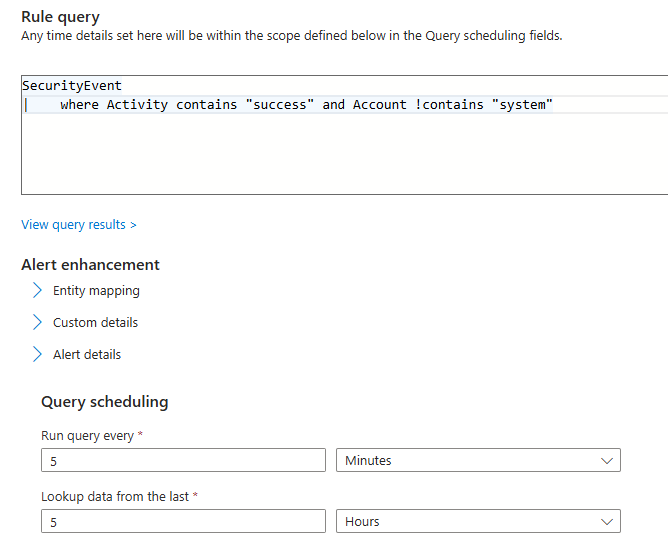

# Cybersecurity Projects 

Showcasing hands-on projects in cybersecurity, demonstrating expertise in network security, threat analysis, and system optimization. Each project reflects my commitment to safeguarding digital environments through innovative solutions.

## Creating a SOC

> Built a Security Operations Center (SOC) in a home lab environment by deploying a Security Information and Event Management (SIEM) system. Configured it to monitor devices and generate real-time alerts. Integrated an intelligence feed to detect commonly seen and newly discovered indicators of compromise (IoCs).

##### Technology
- Microsoft Azure
  - Virtual Machine (VM): Windows 10 Pro
  - Microsoft Sentinel: Created a Log Analytics Workspace within a Sentinel resource group for centralized monitoring.

##### Process
1. **Set up Azure VM:**  
   - Deployed a Windows 10 Pro virtual machine in Azure.  
   - Intentionally left RDP open on port 3389 to simulate a vulnerability (honeypot).

2. **Configured Log Analytics Workspace in Sentinel:**  
   - Created a Log Analytics Workspace in Sentinel and added it to the existing resource group containing the VM and SIEM tools.

3. **Integrated VM Event Logs:**  
   - Configured the VM to send event logs to the Log Analytics Workspace.  
     - Added a Data Connector for Windows Security Events via AMA in the Sentinel Content Hub.  
     - Set up a Data Collection Rule to manage incoming log data.

4. **Created Alert Rules:**  
   - Developed a custom rule in Sentinel to monitor RDP login activity.  
   - Configured the rule to generate alerts for successful brute-force login attempts via RDP.  

    

#### Key Outcomes
- Successfully established a SIEM solution capable of real-time threat detection and alerting.
- Simulated an environment vulnerable to brute force attacks and demonstrated incident monitoring capabilities.

#### Future Enhancements
- Add more data sources to enrich monitoring capabilities.
- Integrate additional intelligence feeds for broader IoC detection.
- Automate response actions for detected incidents.

----
